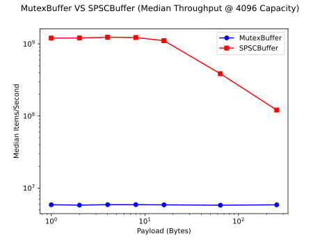
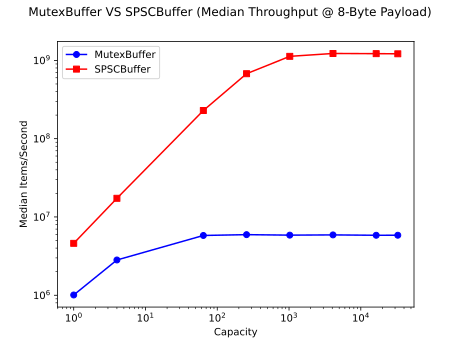
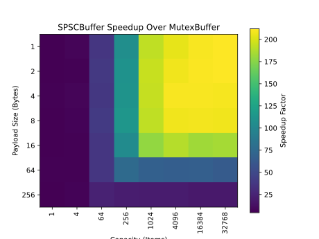
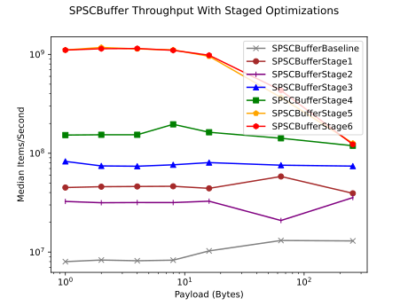
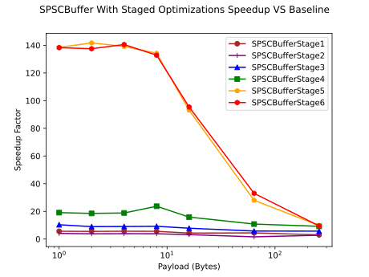
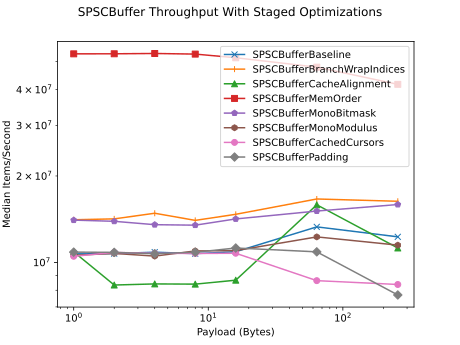
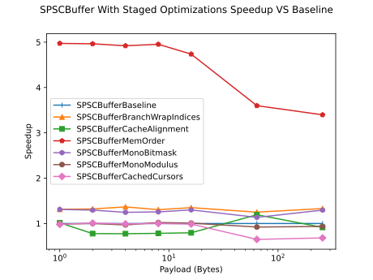

# Ring Buffer Benchmarks

## Contents

- [Overview](#overview)
- [Applications](#applications)
- [Implemented Buffers](#implemented-buffers)
- [SPSCBuffer API](#spscbuffer-api)
- [Correctness Testing](#correctness-testing)
- [Benchmark Methodology](#benchmark-methodology)
- [Main Results](#main-results)
- [Staged Optimization Results](#staged-optimization-results)
- [Isolated Optimization Results](#isolated-optimization-results)
- [Key Findings](#key-findings)
- [Future Work](#future-work)
- [References and Inspiration](#references-and-inspiration)

## Overview

Ring Buffer Benchmarks is a growing C++ library I'm building to study **concurrent FIFO design** and performance, particularly exploring the domain of **lock-free** programming.

These structures are meant to handle pushes (**production**) from a designated thread while another pops (**consumption**) its held data. The producer-consumer model is important in concurrent design as it separates the thread responsible for data intake from the thread responsible for data usage. A developer can configure the quantity of producer/consumer threads, keeping a single producer and a single consumer (**SPSC**), or implementing multi-producer, multi-consumer (**MPMC**) layouts. Currently, Ring Buffer Benchmarks offers a lock-based implementation of a ring buffer that can be used in SPSC and MPMC scenarios, as well as a lock-free ring buffer designed for SPSC usage.

I use **ring buffers** (bounded-capacity, circular queues) as opposed to structures with expandable storage capacity to mitigate the complexity of dynamic storage growth and eliminate hot-path heap allocations. This makes implementation considerably easier to reason about.

As a primary metric for success, I recorded the buffers' **throughput** in **items per second**. 

## Applications

Having a FIFO-like structure is a natural fit for concurrent workloads when there exist processes that intake/produce data and processes that consume/use that data. Developing to minimize latency is essential, meaning correct **lock-free systems can massively improve business outcomes compared to lock-based implementations**.

My particular interest lies in **High-Frequency Trading (HFT)**, where speed can make or break entire trading strategies. As an example, while one thread decodes network packets from an exchange and another thread consumes those packets to update a firm's limit order book, a lock-free FIFO might act as a siphon from one to the other. Maximizing the FIFO's throughput is essential in preventing bottlenecks between the threads. Further, the ring buffer architecture disallows heap allocation, preventing spikes in tail latencies and introducing instability to a running trading strategy.

Of course, lock-free FIFO architectures find their way into other applications that rely on producer-consumer relationships between parallel operations, including:

- **Real-time audio/video systems**
- **Loggers** that avoid costly hot path I/O
- **Game engines** managing multiple threads for physics, graphics, and other tasks
- **Embedded systems** (e.g., sensor sampling, interrupt handling)

## Implemented Buffers

### Main (Namespace `ringbuffers`)

- **MutexBuffer** - A standard lock-protected ring buffer with SPSC and MPMC capabilities. Its implementation is simple and can block, using `std::mutex`, `std::scoped_lock`, `std::unique_lock`, and `std::condition_variable` to serialize access to shared data.
- **SPSCBuffer** - An optimized SPSC lock-free ring buffer making. Being lock-free, its implementation uses only `std::atomic<std::size_t>` to manage buffer arithmetic. Its optimizations include correct memory ordering, cache alignment, cached data members, modulo-free circular buffer arithmetic, and other performance-enhancing features. Although lock-free, its design is not entirely wait-free and spinning on full or empty states will occur.

#### SPSCBuffer API

- **`SPSCBuffer(std::size_t capacity)`** - Constructs a bounded SPSC ring buffer with the requested capacity. Capacity must be at least 1.

- **`push(U&& value)`** - Inserts an element into the buffer, blocking by spinning until space is available.

- **`try_push(U&& value) -> bool`** - Attempts to insert an element without spinning. Returns `true` on success and `false` if the buffer is full.

- **`emplace(Args&&... args)`** - Constructs an element directly in the buffer from the provided arguments, blocking by spinning until space is available.

- **`try_emplace(Args&&... args) -> bool`** - Attempts to construct an element in the buffer without blocking. Returns true on success and false if the buffer is full.

- **`front() -> T*`** - Returns a pointer to the next element available to the consumer, or nullptr if the buffer is empty.

- **`pop()`** - Removes and destroys the current front element. This assumes `front()` has already returned a non-null pointer.

- **`capacity() const -> std::size_t`** - Returns the usable capacity of the buffer.

- **`close()`** - Marks the buffer as closed, allowing the consumer to determine when the producer has finished producing elements.

- **`closed() const -> bool`** - Returns whether the buffer has been marked closed.

### Variants (Namespace `ringbuffers::variants`)

- **SPSCBufferBaseline** - An unoptimized SPSCBuffer. It only uses `std::atomic<std::size_t>` with `std::memory_order_seq_cst` and avoids any of the other optimizations mentioned above. It serves as a baseline for benchmarks and to study the relative effects of each optimization technique.

#### Staged Optimizations (Namespace `ringbuffers::variants::staged`)

One study I conducted was to observe the effects on throughput of adding each optimization feature to SPSCBufferBaseline, progressively stacking them until reaching a fully optimized SPSCBuffer.

- **SPSCBufferStage1** - Removes all `seq_cst` atomic operations and replaces them with `relaxed`, `acquire`, and `release` memory ordering.
- **SPSCBufferStage2** - Separates atomic cursors onto individual cache lines to reduce false-sharing between accessing threads.
- **SPSCBufferStage3** - Adds cached non-atomic copies of each atomic cursor to reduce unnecessary atomic loads and costly cache coherence traffic. Each thread keeps a cached copy of the opposite cursor (e.g. the producer/pushing thread keeps a cached copy of the popping cursor).
- **SPSCBufferStage4** - Adds alignment restrictions to the cached cursors, placing each on their own cache line.
- **SPSCBufferStage5** - Eliminates the modulus operator from cursor arithmetic and uses conditionals to reset cursors to zero if they overflow the storage buffer.
- **SPSCBufferStage6** - Adds two extra cache lines of padding (one to the beginning and another to the end) to the contiguous storage buffer to create an access-exclusion zone. This prevents the first and last positions of the buffer from sharing a cache line with unrelated neighboring data, which may require additional coherence traffic if accessed by other threads.

#### Isolated Optimizations (Namespace `ringbuffers::variants::isolated`)

Another angle I looked at was the effect singular optimizations would produce over the baseline ring buffer. I also acknowledged that some may actually have a negative effect on throughput unless combined with other optimization techniques. Regardless, I was interested in seeing their outcomes and inferring their causes.

- **SPSCBufferMonoModulus** - Uses monotonically increasing cursors with the modulus operator to provide circular buffer arithmetic.
- **SPSCBufferMonoBitmask** - Uses monotonically increasing cursors with bit masking to provide proper circular buffer arithmetic. Also enforces that the buffer size be a power of two.
- **SPSCBufferBranchWrapIndices** - Uses conditionals to return the atomic cursors to zero upon overflow.
- **SPSCBufferCacheAlignment** - Applies cache line alignment (simple `alignas(cacheLineSize)` specifiers) to each atomic member variable.
- **SPSCBufferCachedCursors** - Adds secondary non-atomic cursors to retain copies of each atomic cursor, minimizing atomic loads with `acquire` semantics.
- **SPSCBufferMemOrder** - Applies proper memory ordering specifiers to eliminate `seq_cst` atomic operations.
- **SPSCBufferPadding** - Adds two extra cache lines of padding (one to the beginning and another to the end) to the contiguous storage buffer to create an access-exclusion zone.

## Correctness Testing

I tested and verified implementation correctness using over 30 test cases supported by the **Google Test** testing framework. These tests are subdivided into **unit** and **stress tests**. The unit tests are meant to **verify fundamental operating behaviour** while the stress tests more closely **emulate real usage conditions under greater contention**.

### Unit tests cover scenarios including:

- Object construction and handling invalid capacities
- Calls to each member function
- Behaviour when the buffer is full/empty
- Object construction with lvalue and rvalue arguments
- Termination semantics for while-loop-based consumers
- Destructor behaviour for popped objects

### Stress tests look to verify:

- Correct waiting behaviour on a full/empty queue
- FIFO ordering is preserved after consumption
- Operational correctness with large incoming volume

## Benchmark Methodology

[My full benchmark environment](bench/benchmark-environment.md) 

Benchmarking was conducted using **Google Benchmark** and run across three benchmark "packages": **Main/Headline**, **Staged**, and **Isolated**. These reflect the partition of buffer implementations I discussed in the [Implemented Buffers](#implemented-buffers) section.

- **Main** only compares MutexBuffer with the fully optimized SPSCBuffer.
- **Staged:** compares SPSCBufferBaseline and each staged ring buffer implementation.
- **Isolated:** compares SPSCBufferBaseline and each isolated-optimization ring buffer implementation.

The full grid of capacities and payload sizes (below) is used for each buffer, totaling 56 benchmark scenarios per implementation. Again, the primary metric of performance is throughput, measured as **median items per second** across 20 repetitions.

A single benchmark iteration consists of a **single consumer and single producer** workload. The producer pushes a **fixed number of items** (detailed below) onto the ring buffer while the consumer pops them. A benchmarking iteration is complete once **both the producing and consuming threads have finished execution**.

### Key Specs:

- **CPU:** Intel Core Ultra 7 155H
- **Maximum CPU Clock Frequency:** 4.50 GHz
- **OS:** Ubuntu 24.04
- **Compiler:** g++ 13.3.0
- **C++ Standard:** C++20

### Test Setup:

- **Items Transferred Per Benchmark:** 10,000,000
- **Payload Sizes (Bytes):** 1, 2, 4, 8, 16, 64, 256
- **Capacities:** 1, 4, 64, 256, 1024, 4096, 16384, 32768

Because these benchmarks create producer and consumer threads internally, wall-clock timing is used instead of relying on the default CPU-time measurement. Raw Google Benchmark JSON results are stored in `bench/results/raw/`, summarized CSV files are stored in `bench/results/tabulated/`, and generated plots are stored in `bench/results/plots/`.

## Main Results

### Purpose

To reiterate, this benchmark compares MutexBuffer against the final optimized version of SPSCBuffer under one producer, one consumer contention. Each benchmark transfers 10,000,000 items and sweeps across the above grid of payload sizes and capacities.

### Performance Graphs

### Interpretation

The logarithmic y-axis scaling I used undersells how dramatically the lock-free ring buffer outperforms the lock-based FIFO structure. Where MutexBuffer can achieve a throughput of up to 6 million items per second, SPSCBuffer could see performances of over **1 billion** items per second and speedup factors greater than **200**.

The throughput of both SPSCBuffer and MutexBuffer scales positively with capacity, eventually plateauing. MutexBuffer sees an early peak at a buffer size of 64, where SPSCBuffer's performance continues to rise until capacities above 1024. This is likely the direct **result of mutex contention** swiftly bottlenecking MutexBuffer's performance - concerns of emptiness/fullness are lessened when both the producing and consuming threads can't make progress while contending for the lock. This is made more severe when considering that a consumer must **claim the mutex twice** (once for `front()` and another for `pop()`) in order **to perform a single popping operation**. In the case of SPSCBuffer, without lock contention, progress for both the producer and consumer can proceed more quickly, making the **bottleneck the capacity size itself**. Thus, for lower capacity sizes, SPSCBuffer spends a **greater amount of time spinning on empty/full states** as the available storage is used faster than it can be emptied or replenished. To rephrase, **the producer or consumer might make too much progress and end up spinning, waiting for more volume to push or pop.** With greater capacities, the push and pop cursors have more time to drift apart, preventing collisions that signal full or empty states.

I also noticed an important tradeoff where MutexBuffer's performance is relatively **unfazed** by an increasing payload size, and SPSCBuffer's performance can **drop quite dramatically** on data sizes larger than the integral types. This likely is the result of item construction/destruction, particularly on data sizes of **64 bytes or more**. Construction/destruction sizes scale with payload size. With larger payloads, more memory is copied and more cache lines are touched. This results in **increasing cache coherence traffic**, with synchronization operations needed at each push/pop.

## Staged Optimization Results

### Purpose

This benchmark compares each of the [stacked/staged optimization versions of SPSCBuffer](#staged-optimizations-namespace-ringbuffersvariantsstaged) with SPSCBufferBaseline to understand the effect **progressively tightening optimizations** has on an initially completely unoptimized model. Again, it uses the standard [test setup](#test-setup) though, for presentation, I affix payload size at **4 bytes** (typical integer size). [Full benchmark results](bench/results/tabulated/28-04-2026-staged.csv) are available in CSV format.

To note, SPSCBufferStage6 is **identical to the fully optimized SPSCBuffer** implementation.

### Performance Graphs

### Interpretation

My initial prediction was to witness progressive growth in each buffer's throughput as each optimization was implemented. However, there does exist (explainable) **irregularity in actual recorded throughput**.

As expected, stage 1, which **implements proper memory ordering** and eliminates `std::memory_order_seq_cst` from all atomic operations, had an **immediately positive outcome** on throughput. Deferring from absolute maximal synchronization cost with only `seq_cst` operations to a mix of `relaxed` and `acquire`/`release` operations certainly brought down coherence traffic.

Stage 2 yielded **unexpected results**. After placing each cursor onto distinct cache lines, a typical pattern for reducing false sharing, **performance dropped** from stage 1. My best explanation for this result was that, instead of reducing coherence traffic from false sharing, I ended up simply **spreading the issue** across both atomics - instead of constant contention and cross-thread synchronization relegated to one shared cache line, I enabled those negative effects for two distinct lines.

Stage 3 **mitigates some of the consequences** of stage 2. Implementing non-atomic cached cursors, another common design pattern, drastically reduced the number of cross-thread atomic reads, meaning **reduced overall coherence traffic**. As a result, stage 3 **exceeds both stages 1 and 2** in performance as expected.

Another somewhat unexpected result occurred in stage 4, where separating each non-atomic cursor onto their own cache lines actually **improved performance dramatically**, nearly **doubling throughput**. I believe this is because, when a particular non-atomic cursor is written to, the shared cache line now requires coherence on the opposite thread, even if the associated atomic was not altered.

Stage 5 demonstrated the importance of a strong indexing method. Until this point, I had been using the **modulus operator** to rewrite each atomic cursor. Modulus and division operations are relatively **computationally expensive**, taking significantly more CPU cycles to complete than other basic arithmetic operations. Instead, I employed a **simple conditional** (if the cursor is about to exceed the bounds of the buffer, reset it back to zero), **eliminating modulo operations entirely**. The results of this can be seen in the plot, achieving up to a **140x speedup** over the baseline implementation.

After adding buffer padding in stage 6, maximum performance was likely already reached. The intention was to guard the buffer itself from potentially harmful heap allocation performed by other threads (e.g., an allocated datum sharing the same cache line as the final element in the buffer may force additional coherence traffic when accessing elements from that line), creating an exclusion zone around it. Because the benchmark suite only relies on only two threads that contact exclusively the buffer itself, the performance-guarding effect this optimization was meant to induce was not realized. However, it does future-proof the FIFO as a library for use in wider code.

## Isolated Optimization Results

### Purpose

I wanted to note the effects of individual optimization techniques and understand how they impact performance individually.

A subgroup of these optimizations, **Baseline, MonoModulus, MonoBitmask, and BranchWrapIndices**, test different indexing strategies for the owned storage buffer. My goal was to compare each of their performance and select the fastest for the final SPSCBuffer implementation.

### Performance Graphs

### Interpretation

Evidently, installing correct and minimal memory ordering had the most significant positive impact on performance. Eliminating `std::memory_order_seq_cst` as much as possible is generally a sought-after performance tactic in any lock-free design, outside of debug builds.

**Cache-line layout changes were not very effective in isolation.** Cache alignment and padding did not produce large standalone speedups, and in some cases hurt performance. The staged results suggest these layout changes become more valuable when combined with correct memory ordering.

My aforementioned subpackage of indexing strategy benchmarks yielded valuable results, demonstrating that **branch-based indexing is the most performant**, with the bitmasking method following closely behind. This segment of experimentation highlights the impact that the modulus operator can have, with the two other modulus-based implementations lagging behind.

## Key Findings

- Lock-free programming is a powerful tool and can **significantly outpace conventional lock-based solutions** at the significantly **increased cost of verifying correctness and reduced usage flexibility**.
- Correct memory ordering and avoiding `std::memory_order_seq_cst` is **essential** for performance.
- Cache-aware structures, caching data, and avoiding atomic loads when possible can powerfully **reduce coherence traffic**.
- Innocent-seeming arithmetic operations (e.g. the use of modulo) can have **significant** performance impact.
- Payload and capacity sizes can bottleneck performance, though results may eventually taper off.

## Future Work

- **Add hardware-counter analysis with `perf`.** The current benchmark suite focuses on wall-clock throughput. A useful next step would be collecting hardware-counter data such as cache misses, branch misses, instructions, cycles, and context switches to better explain why certain optimizations help or hurt.
- **Add latency-focused benchmarks.** The current benchmarks focus on throughput. A future latency suite could measure per-message latency distributions, including p50, p95, and p99 behavior.
- **Compare against established implementations.** Add external benchmarks against implementations such as `boost::lockfree::spsc_queue` or Eric Rigtorp’s SPSC queue to better contextualize the custom `SPSCBuffer`.
- **Implement additional queue architectures.** Extend the project beyond SPSC by implementing and benchmarking MPMC queues and potentially a Disruptor-style ring buffer.

## References and Inspiration

- [Eric Rigtorp's SPSC Lock-Free Queue Implementation](https://github.com/rigtorp/SPSCQueue) and [his blog about it](https://rigtorp.se/ringbuffer/)
- [Single Producer Single Consumer Lock-free FIFO From the Ground Up - Charles Frasch - CppCon 2023](https://www.youtube.com/watch?v=K3P_Lmq6pw0&t=3057s)
- CppReferences for [std::atomic](https://en.cppreference.com/cpp/atomic/atomic) and [std::hardware_destructive_interference_size](https://en.cppreference.com/cpp/thread/hardware_destructive_interference_size)